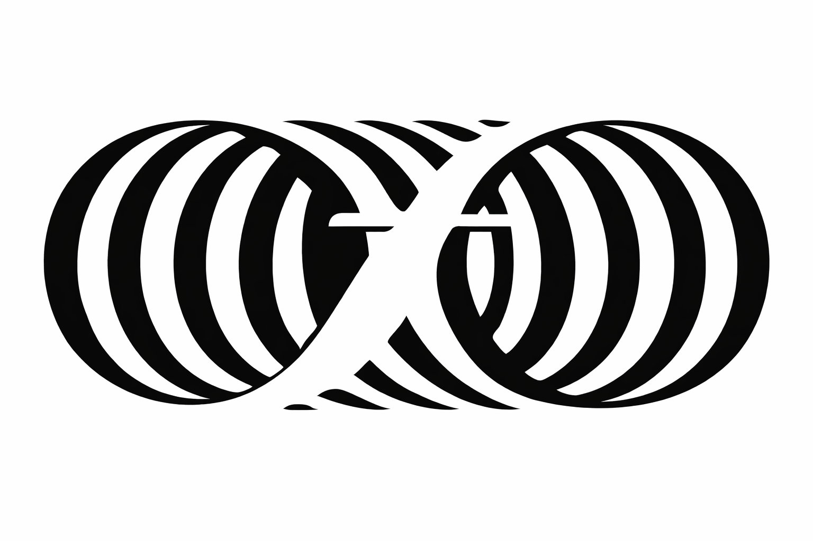

> Feldenkraisova® metoda je psychosomatická metoda vzdělávání, využívající neuroplasticitu mozku k zlepšení kvality pohybu a všech oblastí lidského života.

Feldenkraisova® metoda je na celém světě vyhledávána lidmi jakéhokoliv věku a v jakékoliv psychosomatické kondici pro svoji účinnost v oblasti tělesné, psychické i profesní (sportovci, hudebnící, tanečnící...). Metoda je přínosná i pro děti se speciálními potřebami.

---

## Feldenkraisova® metoda používá dvě metody:

1. ATM Pohybem k sebeuvědomění
   - Praktik Feldenkraisovy® metody provází účastníky lekce prostřednictvím slovních pokynů k pohybům. Důraz je kladen na prožití a vnímání pohybu, který se provádí pomalu a v malém rozsahu. Cílem je objevovat nové a fyziologicky výhodnější vzorce pohybu.

2. Funkční integrace - FI
   - Praktik Feldenkraisovy® metody jemně pohybuje s tělem klienta a dotýká se ho. Společně prozkoumávají funkčnost pohybů jednotlivých částí těla v situaci bezpečí a kinestetického dialogu, při němž klient zůstává pasivní, relaxovaný.

---

## Kdy je metoda přínosná?

- [x] Nezávisle na věku rozvíjí osobnost, zlepšuje koordinaci, flexibilitu a kvalitu života
- [x] Snižuje a odstraňuje chronické nebo akutní bolesti v těle
- [x] Podporuje a efektivně pomáhá dětem se speciálními potřebami  (např. vývojové, neurologické)
- [x] Zlepšuje pohyblivost a koordinaci těla
- [x] Zefektivňuje pohyb a dělá ho ladným
- [x] Pomáhá k dobré organizaci a flexibilitě těla i mysli
- [x] Zvyšuje vnímavost obecně
- [x] Poskytuje radost a dobrý pocit, dobrou náladu
- [x] Výrazně zvyšuje funkčnost těla
- [x] Odbourává stres a pomáhá relaxovat
- [x] Podporuje zdravé sebevědomí
- [x] Zlepšuje komunikační dovednosti
