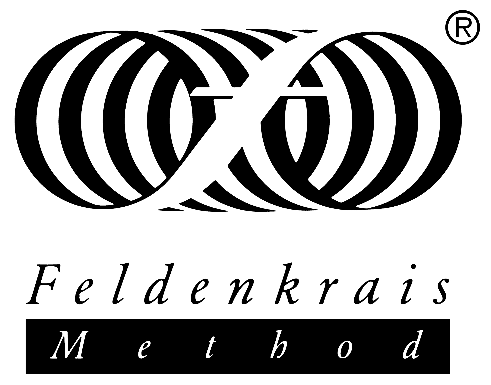

_Feldenkraisova® metoda je psychosomatická metoda vzdělávání, která využívá schopnost nervového systému učit se a měnit – neuroplasticitu – ke zlepšení kvality pohybu, vnímání sebe sama a každodenního fungování._

Vychází z přirozené schopnosti člověka _učit se prostřednictvím pohybu a vlastní zkušenosti. Nejde o cvičení založené na opakování správných pohybů ani o mechanickou nápravu těla. Prostřednictvím jemného pohybu, pozornosti a vnímání rozdílů vytváříme podmínky, ve kterých může nervový systém objevovat **nové a funkčně výhodnější možnosti pohybu a organizace těla**_.

Metodu vyhledávají lidé nejrůznějšího věku a v rozdílné fyzické i psychické kondici. Využívají ji lidé s bolestmi nebo pohybovým omezením, ale také ti, kteří chtějí _zlepšit koordinaci, pohyblivost, vnímání vlastního těla a celkovou kvalitu života_.

Principy Feldenkraisovy metody® využívají rovněž _sportovci, hudebníci, tanečníci a další profese, u kterých je důležitá přesnost, koordinace a efektivita pohybu. Přínosná může být také **pro děti se speciálními potřebami**, kterým individuální a respektující přístup nabízí prostor pro objevování a rozvoj jejich vlastních pohybových možností_.

## Dvě formy Feldenkraisovy metody®

Feldenkraisova® metoda se praktikuje ve dvou základních formách. Principy jsou společné, liší se však způsobem, jakým lekce probíhá.

### ATM – Pohybem k sebeuvědomění

_ATM (Awareness Through Movement®)_ je skupinová nebo individuální lekce vedená slovními pokyny praktika Feldenkraisovy metody®. Účastníci většinou pracují vleže nebo vsedě a prozkoumávají různé pohybové možnosti.

Pohyby se provádějí _pomalu, pozorně a zpravidla v příjemném rozsahu_. Důležitější než velikost nebo výkon je způsob, jakým pohyb vzniká – kde začíná, které části těla se na něm podílejí, jak spolupracují a kde se objevuje zbytečné úsilí.

Prostřednictvím různých variant pohybu dostává nervový systém možnost porovnávat, rozlišovat a učit se. Cílem je postupně objevovat _efektivnější, příjemnější a lépe koordinované pohybové vzorce_, které se mohou přenášet i do běžného života.

### Funkční integrace – FI

_Funkční integrace (FI)_ je individuální forma Feldenkraisovy metody®. Praktik prostřednictvím jemného doteku a citlivě vedených pohybů komunikuje s nervovým systémem klienta a společně prozkoumávají možnosti pohybu jednotlivých částí těla i jejich vzájemné propojení.

Klient je většinou pohodlně oblečený a leží nebo sedí na speciálním lehátku. Nemusí aktivně cvičit ani podávat výkon. V bezpečném prostředí může _uvolnit zbytečné úsilí, vnímat nové pohybové možnosti a nechat nervový systém učit se prostřednictvím kinestetické zkušenosti_.

Více o individuální práci najdete v části _Funkční integrace_.

## Kdy může být Feldenkraisova® metoda přínosná?

Feldenkraisova® metoda není určena pouze lidem, kteří mají nějaký problém. Její princip spočívá především v _učení a rozšiřování možností_, a proto ji lze využívat v různých životních situacích a v každém věku.

Může pomáhat _zlepšovat koordinaci, flexibilitu a celkovou organizaci pohybu_. Člověk se učí využívat své tělo efektivněji, s menším množstvím zbytečného napětí a úsilí. Pohyb se tak může postupně stávat lehčím, plynulejším a přirozenějším.

Vyhledávají ji také lidé s _bolestmi zad, šíje, ramen, kloubů nebo jiných částí pohybového aparátu_. Změna způsobu, jakým tělo organizuje pohyb a rozkládá zátěž, může přispívat ke snížení přetěžování a zmírnění některých obtíží. Metoda přitom nenahrazuje lékařskou péči nebo rehabilitaci tam, kde jsou potřeba.

## Tělo a psychika nejsou oddělené

Feldenkraisova® metoda pracuje s člověkem jako s celkem. _Pohyb, vnímání, emoce, myšlení a způsob, jakým jednáme, se navzájem ovlivňují._

Pomalá práce s pohybem a pozorností může přispívat k _uvolnění, snížení stresu a psychického napětí_. Lidé často popisují nejen změnu pohybu, ale také větší klid, lepší schopnost vnímat sami sebe a příjemnější pocit ve vlastním těle.

Rozvíjení vnímavosti může zároveň podporovat _sebedůvěru, schopnost reagovat na změny a komunikovat s okolím s větší jistotou_.

## Děti se speciálními potřebami

Zvláštní oblastí využití Feldenkraisovy metody® je práce s _dětmi se speciálními potřebami_, včetně dětí s vývojovými nebo neurologickými obtížemi.

Dítě není nuceno opakovat pohyb, který nedokáže provést. Prostřednictvím jemného pohybu, hry a smyslové zkušenosti dostává příležitost _objevovat další možnosti a vytvářet si vlastní zkušenost s pohybem_. Práce vždy vychází z individuálních možností konkrétního dítěte.

## Pro sportovce, hudebníky a tanečníky

Feldenkraisova® metoda může být velmi zajímavá také pro lidi, kteří od svého těla vyžadují vysokou úroveň koordinace a přesnosti.

_Sportovci, tanečníci, hudebníci i další profesionálové_ ji využívají k hledání efektivnější organizace pohybu, zlepšení koordinace a odstranění nadbytečného úsilí. Cílem není pouze větší výkon, ale schopnost dosáhnout výsledku _s větší lehkostí, přesností a menším přetěžováním_.

## Co si vzít na lekci ATM

Na skupinovou lekci _Pohybem k sebeuvědomění (ATM)_ si přineste _podložku, deku a pohodlné vrstvené oblečení_. Většina lekce probíhá vleže nebo vsedě a pohyby bývají pomalé, proto je důležité, aby vám bylo příjemně a teplo.

Není potřeba žádná předchozí zkušenost s Feldenkraisovou metodou®, jógou ani jiným pohybovým systémem.

## Co můžete během lekce očekávat

Na lekci vás budu slovně provázet pohybovými sekvencemi. Nebudu vám ukazovat jediný „správný“ způsob provedení. Budete mít prostor _zkoumat, porovnávat a hledat variantu, která je pro vaše tělo v daném okamžiku nejpříjemnější_.

Někdy jsou pohyby velmi malé a zdánlivě jednoduché. Právě díky pomalému tempu a pozornosti však můžete začít vnímat souvislosti, kterých si při běžném pohybu nevšimnete.

## Co můžete vnímat po lekci

Po lekci můžete zaznamenat _větší lehkost pohybu, volnější záda a klouby, změnu držení těla, příjemnější chůzi nebo snadnější dýchání_. Častý je také pocit celkového uvolnění, klidu a dobré nálady.

Změny nemusí být vždy výrazné okamžitě. Někdy si jich všimnete až při běžných činnostech – při chůzi, řízení auta, práci, sportu nebo třeba při vstávání ze židle.

## Pohybem se učíme

Základním principem Feldenkraisovy metody® není snaha člověka „opravit“. _Je jím vytvoření podmínek pro učení._

Když nervový systém dostane možnost bezpečně prozkoumávat různé varianty pohybu, může začít rozpoznávat, které z nich jsou pro něj výhodnější. Postupně tak rozšiřujeme svůj pohybový repertoár a získáváme _větší svobodu v tom, jak se pohybujeme, jak reagujeme a jak používáme sami sebe v každodenním životě_.
