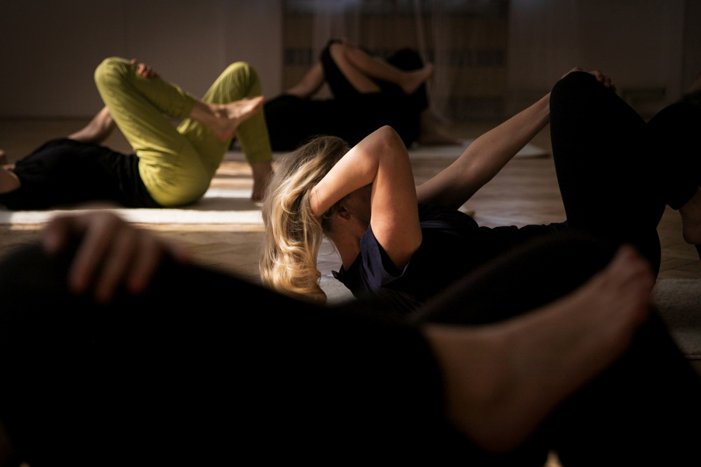

##### Zdroj: Miya Špačková

_Jóga pro dobrý pocit_ je koncept, který propojuje jógovou praxi s principy _Feldenkraisovy metody®. Cílem není jen zvládnout jednotlivé pozice, ale postupně \*\*zlepšovat jejich provedení, pohyblivost, stabilitu a sílu_ a zároveň se učit používat tělo tak, aby byl pohyb přirozenější, bezpečnější a příjemnější.

Prvky Feldenkraisovy metody® využívám především jako _cestu do jógových pozic. Pomocí menších, jemných a přesně vedených pohybů nejprve připravujeme jednotlivé části těla a hledáme jejich vzájemnou spolupráci. Díky tomu se můžete do ásany dostat snadněji, s lepší organizací pohybu a bez zbytečného napětí. Postupně tak můžete pozorovat, že pozice, které byly zpočátku obtížné, se stávají \*\*dostupnějšími, stabilnějšími a příjemnějšími_.

## Co můžete od lekcí očekávat

Pravidelným cvičením budeme pracovat na tom, aby se _zlepšovalo provedení jednotlivých jógových pozic, zvětšovala se pohyblivost a současně se tělo postupně zpevňovalo. Významnou součástí lekcí je práce s \*\*core – funkčním středem těla a hlubokým stabilizačním systémem_. Nejde jen o posilování břišních svalů, ale o koordinovanou spolupráci středu těla, pánve, páteře a dechu.

Velkou pozornost věnujeme _zdravému a funkčnímu pohybu páteře. Učíme se rozložit pohyb mezi jednotlivé části těla tak, aby některé oblasti nemusely neustále přebírat nadměrnou zátěž. Pravidelná praxe tak může přispět k \*\*prevenci a zmírnění bolestí zad_, lepšímu držení těla a větší lehkosti při běžném pohybu.

## Silnější a pružnější tělo

Lekce kombinují _mobilitu, stabilitu, posílení a protažení. Postupně budujeme pevnější střed těla, sílu nohou, paží i zad a současně zachováváme pružnost a volnost pohybu. Cílem není být co nejvíce ohebný, ale vytvořit tělo, které je \*\*silné, pohyblivé a dobře koordinované_.

Pokrok nemusí znamenat pouze větší rozsah pohybu. Může se projevit také tím, že pozici zvládnete s menším úsilím, lépe v ní dýcháte, máte větší stabilitu nebo ji dokážete provést bez nepříjemného napětí.

## Jóga pro tělo i psychiku

Součástí lekcí je také _vědomá práce s dechem, pozorností a vnímáním vlastního těla_. Soustředění na pohyb pomáhá odvést pozornost od každodenního shonu a vytváří prostor pro zklidnění.

Pravidelná pohybová praxe může přispět ke _snížení stresu a psychického napětí, lepší náladě a celkovému pocitu fyzické i psychické pohody. Právě odtud vychází název \*\*Jóga pro dobrý pocit_ – cílem lekce není jen něco odcvičit, ale odcházet s pocitem, že se ve svém těle cítíte lépe.

## Pro koho je Jóga pro dobrý pocit vhodná

Lekce jsou vhodné pro _začátečníky i pokročilejší_, pro lidi se sedavým zaměstnáním i pro ty, kteří již pravidelně sportují. Každý může pracovat podle svých aktuálních možností a postupně se posouvat dál.

Nemusíte být ohební ani znát jógové pozice. Důležitější je chuť _poznávat své tělo, postupně se zlepšovat a budovat sílu, stabilitu i pohyblivost_.

## Co si vzít s sebou

Na lekci si přineste _vlastní jógovou podložku, deku a pohodlné vrstvené oblečení_, které vás nebude omezovat v pohybu. Vrstvy jsou praktické, protože při aktivnější části lekce je můžete odložit a při klidnějších částech nebo závěrečné relaxaci se naopak přiobléct či přikrýt dekou.

## Co můžete vnímat po lekci

Po lekci můžete cítit příjemné protažení a zároveň _aktivaci a zpevnění těla_, větší volnost v zádech a kloubech nebo lehčí a vzpřímenější držení těla. Často se dostavuje také pocit psychického uvolnění a klidu.

Při pravidelném cvičení můžete postupně sledovat vlastní pokrok – _pozice jsou jistější a přesnější, tělo silnější a pohyblivější a pohyb vyžaduje méně zbytečného úsilí_.

## Nejde o dokonalou pozici. Jde o to, jak se v ní cítíte.

V Józe pro dobrý pocit nesoutěžíme a nesnažíme se tělo násilím dostat do určitého tvaru. Pomocí principů Feldenkraisovy metody® hledáme cestu, _jak se do pozice dostat lépe_, a prostřednictvím jógy potom rozvíjíme sílu, stabilitu, pohyblivost a schopnost v ní být.

_Tělo se postupně zpevňuje, pohyb se zlepšuje a jóga se stává něčím, po čem se jednoduše cítíte dobře._
