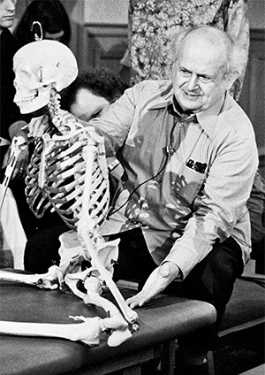

**Moshé Feldenkrais** (6. května 1904 – 1. července 1984) byl významný izraelský fyzik, inženýr, pedagog a mistr bojových umění, který vytvořil **Feldenkraisovu metodu** — vzdělávací systém založený na pohybu a vědomí.

## Vzdělání a vědecká dráha

Vystudoval strojní a elektrické inženýrství a získal doktorát z fyziky (D.Sc.) na Sorbonně v Paříži.

Pracoval jako výzkumný asistent u nobelisty Frédérica Joliot‑Curie v Radium Institutu v Paříži, kde se podílel na raných jaderných výzkumech.

Během 2. světové války byl ve Velké Británii, kde pracoval na technologii SONAR (anti‑ponorkové zařízení) pro britskou admirality — výsledkem byly i několikeré patentové aplikace v oblasti zvukové technologie.

## Mistrovství v bojových uměních

Již v mládí se věnoval ju‑jitsu a judu.

V Paříži se setkal s Jigoro Kanóem, zakladatelem juda, a stal se jedním z prvních Evropanů s černým pásem v tomto bojovém umění.

Byl učitelem juda, publikoval knihy o ju‑jitsu i judu a založil jeden z prvních ju‑jitsu/judo klubů v Evropě.

Během služby v Británii učil sebeobranu a bojové techniky spolupracovníky a vojáky.

Jeho zkušenosti z bojových umění byly později významným inspiračním zdrojem pro jeho pohybové myšlení a koncepty metody.

## Vývoj Feldenkraisovy metody

Po vážném zranění kolene, které utrpěl při sportech, se rozhodl nepodstupovat chirurgický zákrok, a místo toho zkoumal, jak si lze pomoci sám pomocí pohybu a vědomí.

Kombinoval poznatky z fyziky, biomechaniky, anatomie, psychologie, vývojového učení a neurověd.

Ve 40. a 50. letech začal svůj přístup pedagogicky formovat a vyučovat, publikoval klíčové dílo Body and Mature Behavior (1949).

Postupně vyvinul systém, který se dnes dělí na dvě hlavní formy: **Awareness Through Movement️** a **Functional Integration️**.

## Učení a učitelské kurzy

Feldenkrais sám trénoval nové učitele — od 60. let vedl několik oficiálních výcviků ve Tel Avivu, San Franciscu a Amherst, USA.

Do roku 1983 vyškolil přibližně 300 praktiků Feldenkraisovy metody, kteří dále vzdělávali další generace.

## Odkaz

Jeho metoda se dnes praktikuje v desítkách zemí světa a ovlivnila oblasti jako rehabilitace, somatické vzdělávání, fyzioterapie, pedagogika, umění a psychologie.
