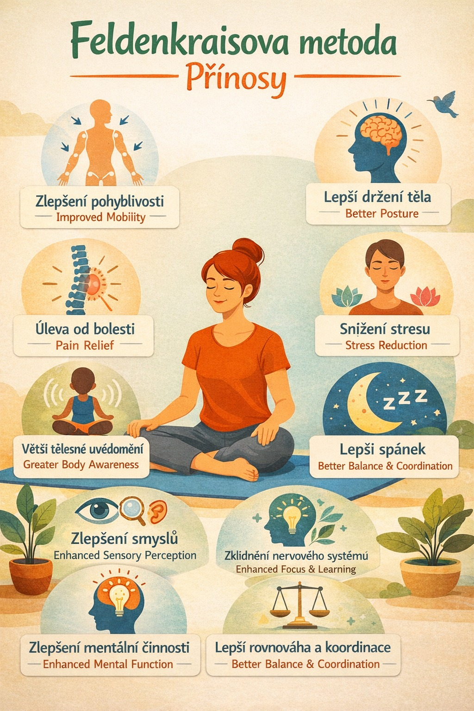

Feldenkraisova metoda je jemná, ale hluboce účinná pohybová metoda, která rozvíjí vědomí těla a podporuje přirozenou schopnost nervového systému učit se, regenerovat a adaptovat. Skrze vědomý pohyb dochází k postupné reorganizaci pohybových i myšlenkových vzorců.

Pravidelná praxe může přinést:

- Zlepšení pohyblivosti a lehkosti pohybu

  Pohyb se stává plynulejším, efektivnějším a méně namáhavým.

* Lepší držení těla a stabilitu

  Tělo nachází přirozenou oporu bez zbytečného napětí a přetěžování.

* Pomoc při chronických bolestech

  Metoda pomáhá odhalovat a měnit dlouhodobé pohybové návyky, které mohou stát za bolestmi zad, šíje, kloubů či hlavy. Dochází k postupnému uvolnění a snížení přetížení.

* Zklidnění nervového systému a snížení stresu

  Jemná práce s pozorností podporuje hlubší regulaci, pocit bezpečí a vnitřní rovnováhu.

* Větší tělesné uvědomění

  Citlivější vnímání vlastního těla umožňuje zdravější a vědomější pohyb.

* Zlepšení smyslového vnímání (zrak, sluch, rovnováha)

  Propojení pohybu a smyslů může vést k jasnějšímu vnímání zraku, lepší orientaci v prostoru, citlivějšímu sluchu a stabilnější rovnováze.

* Efektivnější myšlení a lepší soustředění

  Když se zlepší organizace pohybu, zefektivňuje se i organizace myšlení. Mnoho lidí popisuje větší mentální jasnost, kreativitu a schopnost řešit situace s lehkostí.

* Lepší rovnováha a koordinace

  Větší jistota při chůzi, sportu i běžných denních činnostech.

* Kvalitnější spánek a celková regenerace

  Uvolněné tělo a harmonizovaný nervový systém podporují hlubší odpočinek.
