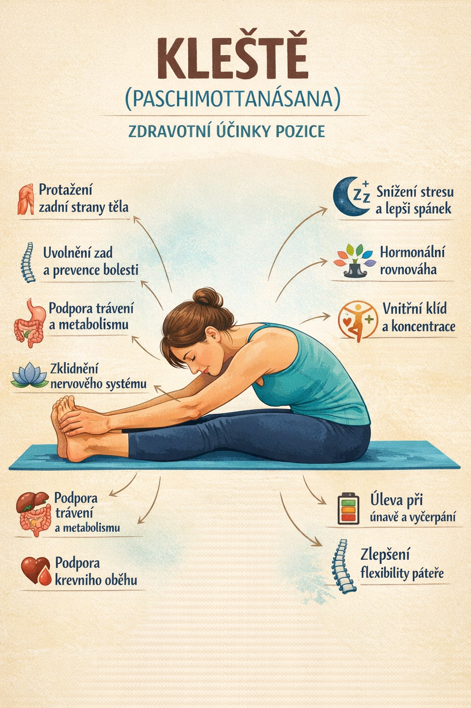

_Kleště (Paschimottanásana)_ patří mezi základní jógové pozice zaměřené na intenzivní protažení zadní strany těla. Kromě fyzických účinků má silný vliv i na psychiku – pomáhá zpomalit a obrátit pozornost dovnitř.

---

## Jak na to (krok za krokem)

1. _Sed (Dandásana)_  
   Sedni si s nataženýma nohama, chodidla flexovaná, záda rovná.

2. _Nádech – vytáhni se vzhůru_  
   Zvedni ruce nad hlavu a prodluž páteř.

3. _Výdech – předklon z kyčlí_  
   Předkloň se pomalu dopředu. Pohyb vychází z kyčlí, ne z kulacení zad.

4. _Uchopení nohou_  
   Chyť chodidla, kotníky nebo holeně.

5. _Setrvání_  
   Uvolni šíji, ramena i obličej. Dýchej klidně 30–60 sekund.

6. _Návrat_  
   S nádechem se pomalu vrať zpět.

---

## Tipy pro pohodlnější provedení

- Pokrč kolena, pokud tě tahají zadní stehna
- Použij pásek na přitažení chodidel
- Sedni si na složenou deku pro lepší postavení pánve

---

## Zdravotní benefity (rozšířené)

_1. Intenzivní protažení svalů_

- hamstringy (zadní strana stehen)
- lýtka
- svaly podél páteře

_2. Uvolnění zad a prevence bolesti_  
Pomáhá zmírnit napětí v bedrech a ztuhlost páteře (při správném provedení).

_3. Podpora trávení a metabolismu_  
Stlačení břišní oblasti stimuluje:

- střeva
- játra
- slinivku

_4. Zklidnění nervového systému_

- snižuje stres a úzkost
- podporuje parasympatický nervový systém („rest & digest“)
- vhodná při nespavosti

_5. Zlepšení flexibility a mobility_  
Zvyšuje rozsah pohybu v kyčlích i páteři.

_6. Podpora krevního oběhu_  
Napomáhá lepšímu prokrvení oblasti pánve a zad.

_7. Hormonální rovnováha_  
Nepřímo stimuluje endokrinní systém.

_8. Posílení koncentrace a vnitřního klidu_  
Podporuje mindfulness a práci s dechem.

_9. Pomoc při únavě a vyčerpání_  
Regeneruje tělo i mysl.

_10. Lepší držení těla_  
Učí správnému zapojení středu těla a prodloužení páteře.

_11. Podpora zdraví pánevního dna_  
Jemně aktivuje a uvolňuje oblast pánve.

_12. Uvolnění napětí v šíji a ramenou_  
Při správném uvolnění horní části těla.

---

## Na co si dát pozor

- Nepřetěžuj bedra – raději pokrč kolena
- Vyhni se při akutních bolestech zad nebo výhřezu ploténky
- Nepřetlačuj tělo silou – jdi jen do příjemného tahu

---

## Shrnutí

Kleště jsou ideální pozice pro zklidnění, protažení i regeneraci. Pravidelným zařazením do praxe získáš pružnější tělo, klidnější mysl a lepší kontakt se svým dechem.
