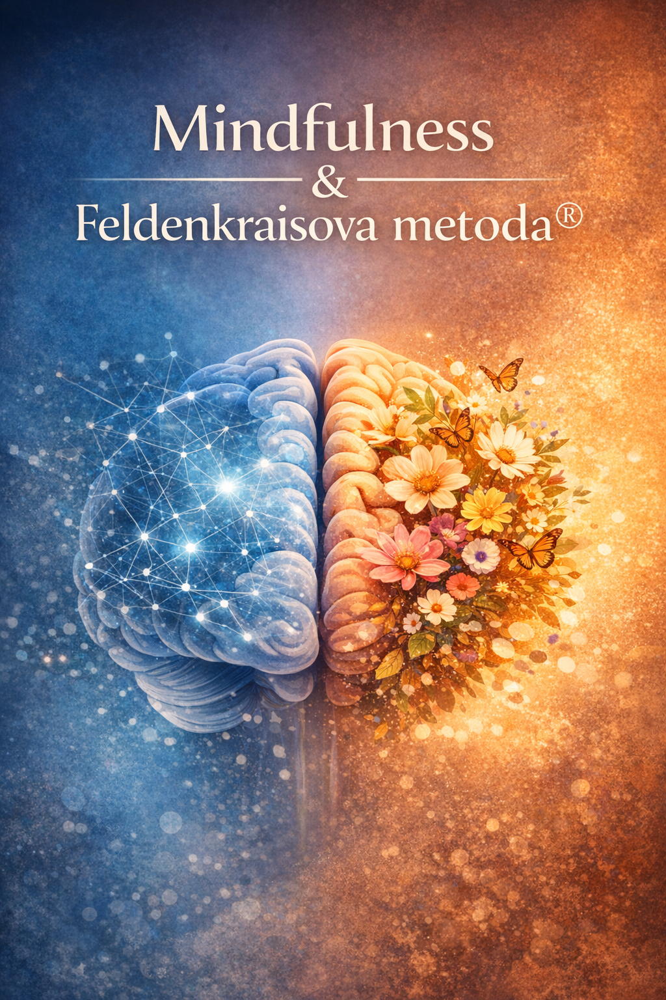

Feldenkraisova metoda® je somatický přístup k učení, který prostřednictvím vědomé práce s pohybem ovlivňuje nejen kvalitu motoriky, ale i oblasti emocí, myšlení a celkového prožívání. Vychází z principu, že změna v organizaci pohybu se promítá do fungování celého nervového systému, a tedy i do psychických procesů.

Z neurovědního hlediska je tento proces spojen s neuroplasticitou – schopností mozku měnit své struktury a funkce na základě zkušenosti. Jemné, diferencované pohybové sekvence vedou ke zlepšení senzoricko-motorické integrace, což má sekundární dopad na regulaci emocí, kvalitu pozornosti i kognitivní flexibilitu.

Mindfulness (všímavost) lze v tomto kontextu chápat jako specifickou formu práce s pozorností, která je ve Feldenkraisově metodě® přirozeně přítomná. V průběhu lekcí je pozornost systematicky vedena k vnímání těla, pohybu a rozdílů v kvalitě prožitku. Tento proces rozvíjí schopnost nehodnotícího uvědomění – tedy klíčový princip mindfulness.

Z tohoto pohledu může být mindfulness vnímána jako dílčí aspekt či kvalita, která je ve Feldenkraisově metodě® inherentně obsažena. Metoda ji však rozšiřuje o konkrétní senzomotorickou zkušenost, čímž propojuje vědomou pozornost s učením skrze tělo.

Feldenkraisova metoda® tak nabízí komplexní rámec, ve kterém se setkává:

- vědomá pozornost (mindfulness)
- pohybové učení
- regulace nervového systému
- integrace tělesného a psychického prožívání

Tento přístup umožňuje nejen zlepšení kvality pohybu, ale i hlubší změny v oblasti emocí, myšlení a celkové kvality života.
