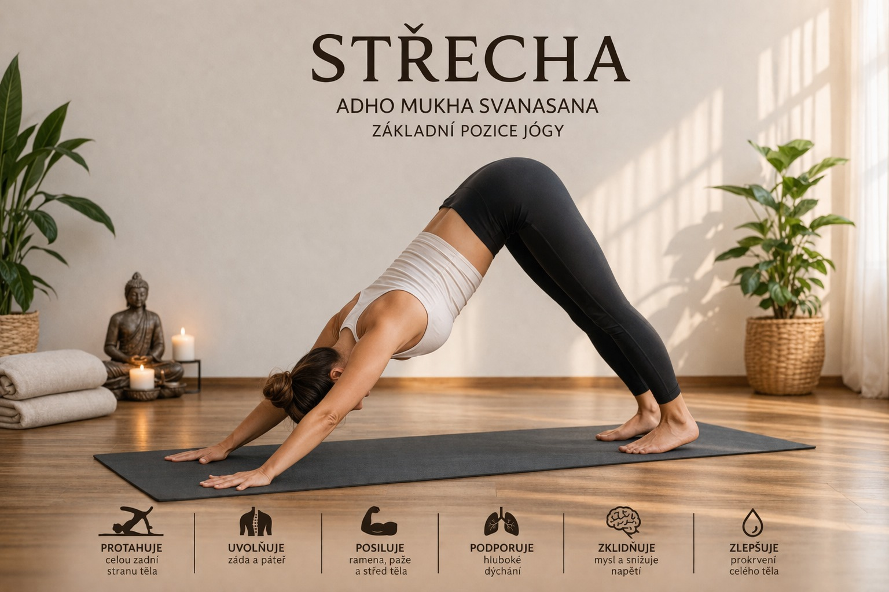

Pozice střechy, známá také jako _Adho Mukha Svanasana (pes hlavou dolů)_, patří mezi nejzákladnější a nejčastěji používané pozice v józe. Přestože se může na první pohled zdát jednoduchá, jedná se o komplexní pozici, která ovlivňuje celé tělo i nervový systém.

---

## Jak pozice vypadá

Tělo vytváří tvar obráceného „V“:

- dlaně a chodidla jsou opřené o podložku
- pánev směřuje vzhůru
- páteř se prodlužuje
- hlava je uvolněná mezi pažemi

Cílem není mít paty na zemi, ale vytvořit _délku a prostor v těle_.

---

## Zdravotní benefity

### 🧠 Podpora nervového systému

Střecha je mírná inverzní pozice, která:

- zlepšuje prokrvení mozku
- podporuje parasympatický nervový systém
- pomáhá snižovat stres a napětí

---

### 🦴 Protažení zadní strany těla

- protahuje hamstringy, lýtka a Achillovy šlachy
- uvolňuje bedra a páteř
- pomáhá při pocitu ztuhlosti zad

---

### 💪 Posílení horní části těla

- aktivuje ramena, paže a lopatky
- zlepšuje stabilitu trupu
- podporuje správné držení těla

---

### 🫁 Podpora dýchání

- rozšiřuje hrudník
- umožňuje hlubší a klidnější dech
- podporuje dechovou kapacitu

---

### ⚖️ Zlepšení koordinace a vnímání těla

- podporuje propojení celého těla
- rozvíjí rovnováhu a stabilitu
- zlepšuje propriocepci (vnímání těla v prostoru)

---

## Časté chyby

- kulatá záda místo prodloužené páteře
- přetěžování rukou
- snaha dostat paty na zem za každou cenu
- zadržování dechu

---

## Jak si pozici přizpůsobit

- pokrč kolena → uvolníš záda
- rozlož váhu mezi ruce a nohy
- využij bloky pod ruce při napětí v zápěstích
- soustřeď se na plynulý dech

---

## Shrnutí

Střecha je základní jógová pozice, která:

- kombinuje posílení i protažení
- podporuje nervový systém
- zlepšuje kvalitu pohybu i držení těla

👉 pravidelná praxe přináší větší lehkost, stabilitu a uvolnění v každodenním životě
