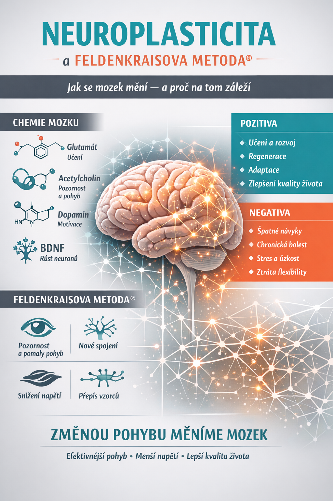

Neuroplasticita je schopnost mozku měnit svou strukturu i funkci na základě zkušeností. Mozek není statický orgán – dynamicky se přizpůsobuje tomu, co děláme, jak se pohybujeme, co vnímáme i jak myslíme.

Tyto změny probíhají po celý život a tvoří základ učení, adaptace i regenerace.

---

## Jak neuroplasticita funguje

Na základní úrovni jde o změny v propojení mezi neurony (synapse):

- _posilování spojů_ (opakovaně používané dráhy se zesilují)
- _oslabování spojů_ (nevyužívané dráhy zanikají)
- _vznik nových spojení_ (např. při učení nebo rehabilitaci)

Mozek tak průběžně optimalizuje své fungování podle zkušenosti.

---

## Neurochemie: co se děje „uvnitř“

Neuroplasticita je nejen strukturální, ale i chemický proces, řízený aktivitou neurotransmiterů a růstových faktorů.

### 🧠 Neurotransmitery

- _Glutamát_ – hlavní excitační neurotransmiter, zásadní pro učení a posilování synapsí
- _GABA_ – tlumí aktivitu, stabilizuje nervový systém
- _Dopamin_ – souvisí s motivací, odměnou a procesem učení
- _Serotonin_ – ovlivňuje náladu a celkovou regulaci systému
- _Acetylcholin (z cholinu)_ – klíčový pro pozornost, učení a jemné řízení pohybu

### 🧪 Cholinergní systém (acetylcholin)

Cholin je esenciální látka, ze které vzniká acetylcholin – neurotransmiter zásadní pro:

- _pozornost a selekci podnětů_
- _schopnost rozlišovat jemné rozdíly_
- _učení nových pohybových i kognitivních vzorců_

Acetylcholin pomáhá „označit“, co je pro mozek důležité – tím podporuje vznik nových synaptických spojení (LTP).

---

### 🌱 Neurotrofní faktory

- _BDNF (brain-derived neurotrophic factor)_  
  podporuje růst neuronů a tvorbu nových spojení  
  → často označován jako „hnojivo pro mozek“

---

### ⚡ Synaptická plasticita

- _LTP (long-term potentiation)_ – dlouhodobé posílení spojů
- _LTD (long-term depression)_ – oslabení spojů

Tyto procesy tvoří biologický základ učení.

---

## Pozitiva neuroplasticity

### 1. Učení a rozvoj

Mozek si dokáže osvojovat nové dovednosti v každém věku.

### 2. Regenerace

Po úrazech nebo neurologických potížích může docházet k reorganizaci funkcí.

### 3. Adaptace

Schopnost přizpůsobit se novým podmínkám.

### 4. Zlepšení kvality života

Vědomá práce s tělem a pozorností může vést ke snížení bolesti a napětí.

---

## Negativa neuroplasticity

Mozek se učí i to, co není funkční:

### 1. Fixace nevhodných pohybových návyků

Opakování vede k automatizaci, i když je vzorec neefektivní.

### 2. Chronická bolest

Bolest může být udržována nervovým systémem i bez jasné příčiny.

### 3. Stres a úzkost

Opakované stresové reakce posilují odpovídající nervové dráhy.

### 4. Ztráta variability

Mozek preferuje stereotyp → méně flexibility, více rigidity.

---

## Feldenkraisova metoda® a neuroplasticita

Feldenkraisova metoda® využívá principy neuroplasticity vědomě a cíleně.

Základní princip:  
_změnou kvality pohybu měníme organizaci nervového systému._

---

## Jak Feldenkraisova metoda® působí

### 1. Pozornost a zpomalení

Pomalý pohyb zvyšuje aktivitu mozkových oblastí spojených s učením a vnímáním.  
→ silnější zapojení acetylcholinu

### 2. Variabilita

Různé varianty pohybu podporují vznik nových nervových spojů.

### 3. Snížení napětí

Dochází ke snížení nadměrné svalové aktivity → vyšší efektivita.

### 4. Přepis vzorců

Mozek získává nové možnosti → staré návyky se mohou reorganizovat.

---

## Neurochemie Feldenkraisovy metody®

Z pohledu neurovědy může metoda podporovat:

- zvýšení _BDNF_ → lepší schopnost učení
- aktivaci _acetylcholinu_ → vyšší kvalita pozornosti a plasticity
- vyvážení _glutamát / GABA_ → stabilnější nervový systém
- aktivaci _parasympatiku_ → snížení stresu
- jemnou modulaci _dopaminu_ → motivace bez tlaku na výkon

Klíčový princip:  
_bezpečné, nebolestivé prostředí = optimální podmínky pro učení mozku_

---

## Shrnutí

Neuroplasticita představuje zásadní schopnost nervového systému – umožňuje změnu, učení i adaptaci. Není však automaticky pozitivní: mozek upevňuje jak funkční, tak nefunkční vzorce.

Feldenkraisova metoda® nabízí způsob, jak neuroplasticitu vědomě ovlivnit:

- skrze pohyb
- skrze pozornost
- skrze kvalitu, nikoli kvantitu

Výsledkem může být:
_efektivnější organizace pohybu, snížení napětí a vyšší kvalita života._
