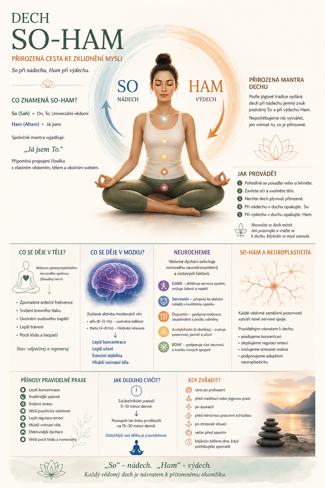

„So“ při nádechu, „Ham“ při výdechu.

Dech _So-Ham_ patří mezi nejstarší meditační techniky indické jógové tradice. Je jednoduchý, přirozený a dostupný každému. Nepotřebujete žádné pomůcky ani předchozí zkušenosti – stačí vědomě sledovat svůj dech a v duchu opakovat dvě slabiky: _So_ při nádechu a _Ham_ při výdechu.

Pravidelná praxe podporuje zklidnění mysli, rozvoj koncentrace a harmonizaci nervového systému.

---

# Co znamená So-Ham?

Výraz pochází ze sanskrtu.

- _So (Sah)_ znamená On, To, Univerzální vědomí.
- _Ham (Aham)_ znamená Já jsem.

Společně se mantra překládá jako:

> _„Já jsem To.“_

Nejde o náboženské tvrzení, ale o symbolické připomenutí jednoty člověka se životem a jeho pravou podstatou.

V jógové filozofii vyjadřuje zkušenost, že naše vědomí není oddělené od okolního světa.

---

# Přirozená mantra dechu

Podle tradičních jógových textů vydává dech při nádechu jemný zvuk připomínající _So_ a při výdechu _Ham_.

Nejde tedy o mantru, kterou bychom vytvářeli silou vůle. Pouze se učíme naslouchat přirozenému rytmu vlastního dechu.

Právě tato jednoduchost činí techniku mimořádně účinnou.

---

# Jak techniku provádět

1. Pohodlně se posaďte nebo si lehněte.
2. Zavřete oči.
3. Uvolněte ramena, čelist i břicho.
4. Nechte dech plynout zcela přirozeně.
5. Při nádechu si v duchu opakujte:

> _So_

6. Při výdechu:

> _Ham_

Nesnažte se dech prodlužovat ani měnit.

Pokud se objeví myšlenky, jemně přiveďte pozornost zpět k dechu a mantře.

---

# Co se děje v těle?

Vědomé dýchání ovlivňuje celý organismus.

## Aktivace parasympatického nervového systému

Klidný dech stimuluje _bloudivý nerv (nervus vagus)_, který je hlavní součástí parasympatického nervového systému.

To vede k:

- zpomalení srdeční frekvence,
- snížení krevního tlaku,
- uvolnění svalového napětí,
- lepšímu trávení,
- pocitu bezpečí a klidu.

Organismus se postupně přesouvá ze stavu _„boj nebo útěk“_ do stavu _„odpočívej a regeneruj“_.

---

# Co se děje v mozku?

Meditace spojená s dechem mění aktivitu mozku.

Výzkumy ukazují zvýšenou aktivitu:

- _alfa vln (8–12 Hz)_ – stav uvolněné bdělosti,
- _theta vln (4–8 Hz)_ – hluboká relaxace, kreativita a introspekce.

Tyto změny podporují:

- lepší koncentraci,
- schopnost učení,
- emoční stabilitu,
- hlubší vnímání vlastního těla.

---

# Neurochemie

Vědomé dýchání může ovlivňovat rovnováhu několika důležitých neurotransmiterů.

## GABA

Hlavní tlumivý neurotransmiter.

Pomáhá snižovat:

- úzkost,
- psychické napětí,
- nadměrnou aktivitu nervového systému.

---

## Serotonin

Podílí se na:

- stabilní náladě,
- kvalitě spánku,
- pocitu psychické pohody.

---

## Dopamin

Souvisí s:

- motivací,
- soustředěním,
- pocitem odměny.

Při pravidelné meditační praxi může přispívat k lepší schopnosti udržet pozornost.

---

## Acetylcholin

Acetylcholin vzniká z _cholinu_, který přijímáme také potravou.

Je důležitý pro:

- pozornost,
- paměť,
- učení,
- řízení pohybu.

Při meditaci pomáhá mozku rozpoznávat jemné rozdíly v dechu a podporuje vytváření nových nervových spojení.

---

## BDNF – „hnojivo pro mozek“

_Brain-Derived Neurotrophic Factor (BDNF)_ je bílkovina podporující:

- růst neuronů,
- přežívání nervových buněk,
- tvorbu nových synapsí.

Pravidelný pohyb, kvalitní spánek i meditace mohou přispívat ke zvýšení jeho hladiny.

---

# So-Ham a neuroplasticita

Neuroplasticita je schopnost mozku měnit svou strukturu a funkci na základě zkušeností.

Každé vědomé zaměření pozornosti vytváří nové nervové spoje.

Pravidelným návratem k dechu:

- posilujeme schopnost koncentrace,
- zlepšujeme regulaci emocí,
- snižujeme automatické stresové reakce,
- podporujeme vznik nových, funkčních nervových drah.

Mozek se postupně učí reagovat klidněji a efektivněji.

---

# Přínosy pravidelné praxe

Při dlouhodobém cvičení může technika přispět k:

- lepší koncentraci,
- kvalitnějšímu spánku,
- snížení stresu,
- větší psychické odolnosti,
- lepší regulaci emocí,
- hlubšímu vnímání vlastního těla,
- efektivnějšímu dýchání,
- většímu pocitu klidu a rovnováhy.

---

# Jak dlouho cvičit?

Začátečníkům postačí:

- _5–10 minut denně._

Postupně lze dobu prodloužit na:

- _15–30 minut denně._

Důležitější než délka je pravidelnost.

I několik minut vědomého dýchání každý den může mít větší přínos než dlouhá, ale nepravidelná meditace.

---

# Kdy je vhodné techniku zařadit?

- ráno po probuzení,
- před meditací nebo jógovou praxí,
- po ásanách,
- před náročnou pracovní schůzkou,
- po stresové situaci,
- večer před spaním,
- kdykoliv během dne, když potřebujete zpomalit.

---

# Závěr

So-Ham je jednoduchá, ale hluboká meditační technika, která využívá přirozený rytmus dechu k rozvoji pozornosti a vnitřního klidu.

Nepotřebujeme měnit dech ani dosahovat zvláštních stavů vědomí. Stačí se vracet k tomu, co je stále přítomné – k nádechu a výdechu.

Pravidelná praxe podporuje harmonii mezi tělem a myslí, rozvíjí schopnost soustředění a vytváří podmínky pro zdravější fungování nervového systému.

> **„So“ – nádech.  
> „Ham“ – výdech.  
> Každý vědomý dech je návratem k přítomnému okamžiku.**
