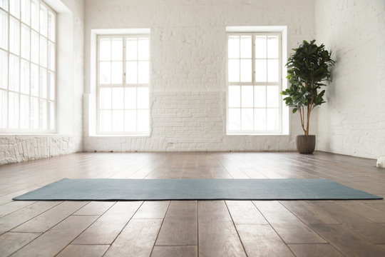

- **Kurz PO 18 h**: od 14. 9. 2026 do 14. 12. 2026 (mimo 28. 9.\*, 5. 10., 26. 10.)
- **Kurz STŘ 18:30 a 19:40 h**: od 16. 9. 2026 do 9. 12. 2026 (mimo 30. 9., 28. 10.)

_\* Opraveno z původního "29. 9." — 28. 9. 2026 je pondělí a státní svátek (Den české státnosti), zatímco 29. 9. je úterý a do rozvrhu pondělního kurzu nezapadá. S opravou vychází přesně 11 lekcí dle ceníku._

### Rozvrh hodin

| Den                     | Čas         | Lekce                                | Místo                   |
| ----------------------- | ----------- | ------------------------------------ | ----------------------- |
| Pondělí                 | 18:00–18:50 | ATM Feldenkraisova metoda            | sál MKS Mníšek pod Brdy |
| Středa                  | 18:30–19:30 | Jóga pro dobrý pocit                 | sál MKS Mníšek pod Brdy |
| Středa                  | 19:40–20:30 | ATM Feldenkraisova metoda            | sál MKS Mníšek pod Brdy |
| Sobota (zhruba měsíčně) | 2–4 hod     | Workshop ATM – Feldenkraisova metoda | —                       |

_(Úterý, čtvrtek, pátek a neděle bez pravidelných lekcí.)_

## Kalendář lekcí — září až prosinec 2026

Legenda:

- 🔵 ATM Feldenkrais I. (Po 18:00)
- 🟢 Jóga pro dobrý pocit (St 18:30)
- 🟠 ATM Feldenkrais II. (St 19:40)
- ❌ lekce odpadá (svátek / volno)

Termíny sobotních workshopů ATM budou doplněny, jakmile budou známy.

### Září 2026

| Po    | Út  | St      | Čt  | Pá  | So  | Ne  |
| ----- | --- | ------- | --- | --- | --- | --- |
|       | 1   | 2       | 3   | 4   | 5   | 6   |
| 7     | 8   | 9       | 10  | 11  | 12  | 13  |
| 14 🔵 | 15  | 16 🟢🟠 | 17  | 18  | 19  | 20  |
| 21 🔵 | 22  | 23 🟢🟠 | 24  | 25  | 26  | 27  |
| 28 ❌ | 29  | 30 ❌   |     |     |     |     |

### Říjen 2026

| Po    | Út  | St      | Čt  | Pá  | So  | Ne  |
| ----- | --- | ------- | --- | --- | --- | --- |
|       |     |         | 1   | 2   | 3   | 4   |
| 5 ❌  | 6   | 7 🟢🟠  | 8   | 9   | 10  | 11  |
| 12 🔵 | 13  | 14 🟢🟠 | 15  | 16  | 17  | 18  |
| 19 🔵 | 20  | 21 🟢🟠 | 22  | 23  | 24  | 25  |
| 26 ❌ | 27  | 28 ❌   | 29  | 30  | 31  |     |

### Listopad 2026

| Po    | Út  | St      | Čt  | Pá  | So  | Ne  |
| ----- | --- | ------- | --- | --- | --- | --- |
|       |     |         |     |     |     | 1   |
| 2 🔵  | 3   | 4 🟢🟠  | 5   | 6   | 7   | 8   |
| 9 🔵  | 10  | 11 🟢🟠 | 12  | 13  | 14  | 15  |
| 16 🔵 | 17  | 18 🟢🟠 | 19  | 20  | 21  | 22  |
| 23 🔵 | 24  | 25 🟢🟠 | 26  | 27  | 28  | 29  |
| 30 🔵 |     |         |     |     |     |     |

### Prosinec 2026

| Po    | Út  | St     | Čt  | Pá  | So  | Ne  |
| ----- | --- | ------ | --- | --- | --- | --- |
|       | 1   | 2 🟢🟠 | 3   | 4   | 5   | 6   |
| 7 🔵  | 8   | 9 🟢🟠 | 10  | 11  | 12  | 13  |
| 14 🔵 | 15  | 16     | 17  | 18  | 19  | 20  |
| 21    | 22  | 23     | 24  | 25  | 26  | 27  |
| 28    | 29  | 30     | 31  |     |     |     |

## Ceny — kurzy, permice, vstupy

**Jednorázový vstup:** 260 Kč

### Kurzy a vstupy 09/26–12/26

| Kurz                          | Termín    | Lekcí |         Cena | Bonus\* |
| :---------------------------- | :-------- | ----: | -----------: | ------: |
| 🔵 ATM Feldenkrais I.         | Po 18:00  |    11 | **2 200 Kč** |    +3,3 |
| 🟢 Jóga s prvky Feldenkrais   | St 18:30  |    11 | **1 980 Kč** |    +4,9 |
| 🟠 ATM Feldenkrais II.        | St 19:40  |    11 | **2 200 Kč** |    +3,3 |
| ⚪ Vstupovka (platí do 06/27) | libovolně |    10 | **2 300 Kč** |    +1,5 |

### Kombinace

| Kombinace                          | Termín                              | Lekcí |     Cena |   Sleva |       Celkem | Bonus\* |
| :--------------------------------- | :---------------------------------- | ----: | -------: | ------: | -----------: | ------: |
| 🔵🟠 DVOJ ATM I. a II.             | Po 18:00 + St 19:40                 |    22 | 4 400 Kč | −200 Kč | **4 200 Kč** |    +7,6 |
| 🟢🔵 DVOJ Jóga a ATM               | St 18:30 + (St 19:40 nebo Po 18:00) |    22 | 4 180 Kč | −100 Kč | **4 080 Kč** |    +8,3 |
| 🔵🟢🟠 TROJ ATM I., ATM II. a Jóga | Po 18:00 + St 18:30 + St 19:40      |    33 | 6 380 Kč | −400 Kč | **5 980 Kč** |     +13 |
| ⚪ Kombi vstupovka ke kurzu        | libovolně                           |     5 | 1 100 Kč |       — | **1 100 Kč** |      +1 |

_\* Bonus = kolik lekcí navíc byste za tuto cenu dostali oproti placení jednorázových vstupů (260 Kč/lekce)._

**Možné náhrady** — ke kurzům lze vystavit fakturu na pojišťovnu.

### Termíny kurzů

- **Kurz PO 18 h**: od 14. 9. 2026 do 14. 12. 2026 (mimo 28. 9., 5. 10., 26. 10.)
- **Kurz STŘ 18:30 a 19:40 h**: od 16. 9. 2026 do 9. 12. 2026 (mimo 30. 9., 28. 10.)

## Platba

Vyplň částku a do zprávy napiš jméno, den a typ kurzu.

## Fakturace

Poskytuji faktury s možností uplatnění u zdravotních pojišťoven nebo zaměstnavatele.

## Podmínky

Předplatné se platí za rezervaci místa v kurzu, nenahrazuje se a nevrací se peníze v případě absence. V případě vážných důvodů je možná po osobní domluvě náhrada části hodin, popř. sleva na další permici. V případě absence je možné za sebe poslat náhradu.
